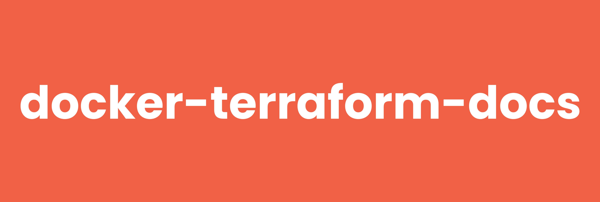

# docker-terraform-docs



[](https://github.com/RagedUnicorn/docker-terraform-docs/actions/workflows/docker_release.yml)
[](https://github.com/RagedUnicorn/docker-terraform-docs/actions/workflows/test.yml)


> Docker Alpine image with the terraform-docs CLI for generating Terraform module documentation.


## Overview

This Docker image provides a minimal [terraform-docs](https://github.com/terraform-docs/terraform-docs)
installation on Alpine Linux. It downloads the official terraform-docs release
from GitHub and **verifies it** (SHA256 checksum) before it is ever placed into
the runtime image. The result is a small, non-root, fully OCI-labelled image with
`terraform-docs` as its entrypoint.

> **A note on verification.** terraform-docs publishes a SHA256 checksum file but
> **no signature** (no cosign or GPG). A verified checksum is therefore the
> strongest guarantee available upstream, and this image always verifies it at
> build time rather than extracting the download blindly.

## Features

- **Small footprint**: minimal runtime image using Alpine Linux
- **Verified download**: SHA256 checksum verified at build time (strongest upstream offers)
- **Single purpose**: `terraform-docs` is the entrypoint - nothing else bundled
- **Non-root user**: runs as the unprivileged `terraform-docs` user
- **Multi-architecture**: supports `linux/amd64` and `linux/arm64`
- **No runtime dependencies**: reads local files and writes docs, no network needed

## Quick Start

```bash
# Pull the image
docker pull ragedunicorn/terraform-docs:latest

# Show the version
docker run --rm ragedunicorn/terraform-docs:latest --version

# Generate markdown docs for the module in the current directory
docker run --rm -v "$(pwd)":/workspace ragedunicorn/terraform-docs:latest markdown .
```

For development and building from source, see [DEVELOPMENT.md](DEVELOPMENT.md).

## Usage

The container uses terraform-docs as the entrypoint, so any terraform-docs
subcommand and flags can be passed directly to the `docker run` command.

### Basic Usage

```bash
# Using latest version
docker run --rm -v "$(pwd)":/workspace ragedunicorn/terraform-docs:latest [terraform-docs-args]

# Using a specific terraform-docs version
docker run --rm -v "$(pwd)":/workspace ragedunicorn/terraform-docs:0.24.0 [terraform-docs-args]

# Using an exact version combination
docker run --rm -v "$(pwd)":/workspace ragedunicorn/terraform-docs:0.24.0-alpine3.22.1-1 [terraform-docs-args]
```

### Examples

```bash
# Generate a markdown table for the module in the working directory
docker run --rm -v "$(pwd)":/workspace ragedunicorn/terraform-docs:latest markdown table .

# Show the terraform-docs version
docker run --rm ragedunicorn/terraform-docs:latest --version

# Emit the documentation as JSON
docker run --rm -v "$(pwd)":/workspace ragedunicorn/terraform-docs:latest json .

# Recurse into submodules
docker run --rm -v "$(pwd)":/workspace ragedunicorn/terraform-docs:latest markdown --recursive .
```

## Runtime Notes

terraform-docs reads a module's `.tf` files and writes documentation to stdout
or, with `--output-file`, back into a file. Keep these in mind:

### A writable workspace is needed for `--output-file`

Reading a module and printing to stdout works with a read-only mount, but
injecting docs into an existing file with `--output-file` needs write access.
The default mount below is writable:

```bash
docker run --rm -v "$(pwd)":/workspace \
  ragedunicorn/terraform-docs:latest markdown table --output-file README.md .
```

terraform-docs replaces the content between `<!-- BEGIN_TF_DOCS -->` and
`<!-- END_TF_DOCS -->` marker comments in the target file.

### Match the host user for bind-mount ownership

The image runs as the non-root `terraform-docs` user. If terraform-docs writes to
a bind mount (with `--output-file`), run the container as your own user so files
stay owned by you:

```bash
docker run --rm --user "$(id -u):$(id -g)" \
  -v "$(pwd)":/workspace ragedunicorn/terraform-docs:latest markdown table --output-file README.md .
```

In Docker Compose, match the host UID/GID:

```yaml
user: "${UID:-1000}:${GID:-1000}"
```

### Configuration file

A `.terraform-docs.yml` file in the module directory lets you pin the output
format, sections, sort order and injection mode. terraform-docs picks it up
automatically:

```bash
docker run --rm -v "$(pwd)":/workspace ragedunicorn/terraform-docs:latest .
```

## Docker Compose Usage

This repository includes Docker Compose configurations for common workflows.

### Basic Setup

```bash
docker compose run --rm terraform-docs markdown .
```

The base `docker-compose.yml` mounts the current directory (writable) at
`/workspace` and matches your host UID/GID. Export `UID`/`GID` first so they are
available to compose:

```bash
export UID GID
docker compose run --rm terraform-docs markdown .
```

### Example Configuration

The `examples/` directory contains a runnable example with a sample module:

```bash
docker compose -f examples/docker-compose.yml run --rm terraform-docs markdown .
```

### Environment Variables

- `TERRAFORM_DOCS_VERSION`: image tag to use (default: `latest`)
- `UID` / `GID`: host user/group IDs for bind-mount ownership

## Building Custom Images

To create a custom image - for example a toolbox that adds extra tooling - start
from this image. Note that adding more tools moves away from the single-purpose
design; a toolbox is better kept in its own repository.

```dockerfile
FROM ragedunicorn/terraform-docs:latest

USER root
RUN apk add --no-cache --update git
USER terraform-docs

WORKDIR /workspace
```

## Versioning

This project uses versioning that matches the Docker image contents:

**Format:** `{terraform_docs_version}-alpine{alpine_version}-{build_number}`

Examples:
- `0.24.0-alpine3.22.1-1` - terraform-docs 0.24.0 on Alpine 3.22.1, build 1
- `latest` - Most recent stable release

The build number resets to `1` whenever terraform-docs is bumped, and is
incremented only for rebuilds that leave the terraform-docs version unchanged (an
Alpine patch or base CVE fix). For the detailed release process, see
[RELEASE.md](RELEASE.md).

## Automated Dependency Updates

This project uses [Renovate](https://docs.renovatebot.com/) to automatically
check for updates to:
- Alpine Linux base image version
- terraform-docs version (tracked via the GitHub releases datasource)

Renovate runs weekly and creates pull requests when updates are available.

## License

This repository - the Dockerfile, scripts and documentation - is licensed under
the **MIT License**.

The bundled **terraform-docs binary** is distributed by the terraform-docs
project under the **MIT License** as well. See terraform-docs'
[LICENSE](https://github.com/terraform-docs/terraform-docs/blob/master/LICENSE)
for the terms governing the binary.

## Documentation

- [Development Guide](DEVELOPMENT.md) - Building, debugging, and contributing
- [Testing Guide](TEST.md) - Running and writing tests
- [Release Process](RELEASE.md) - Creating releases and versioning

## Links

- [terraform-docs Documentation](https://terraform-docs.io/)
- [terraform-docs Releases](https://github.com/terraform-docs/terraform-docs/releases)
- [terraform-docs Configuration](https://terraform-docs.io/user-guide/configuration/)
- [Alpine Linux](https://www.alpinelinux.org/)
